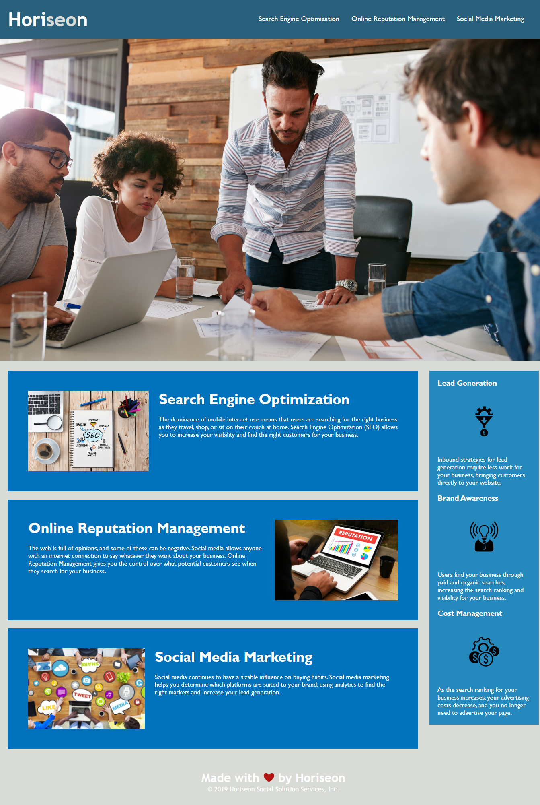

# Horiseon - Media and Marketing Services - Landing Page

## Link

View this site live: [Horiseon Landing Page](https://alibakercodes.github.io/horiseon/)

## Description

This site is the landing page for Horiseon, a Media and Marketing Services company. It uses follows best practices for web accessability, class/id naming conventions, indentation and quality comments. The user will be able to navigate to different cards using the links in the header. An aside is provided for extra business content.

## Screenshot

> **Note**: This layout is designed for desktop viewing.The minimum resolution is 768px. It is not responsive.

##

© 2022 Ali Baker Codes. Confidential and Proprietary. All Rights Reserved.
